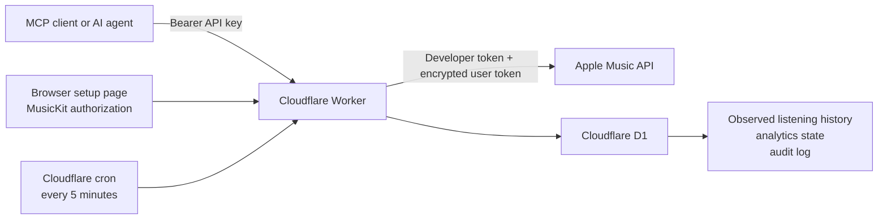

# Apple Music MCP on Cloudflare

A remote Model Context Protocol (MCP) server that lets an AI agent safely work with one Apple Music account. It runs as a Cloudflare Worker, stores authorization and observed listening history in Cloudflare D1, and uses only Apple’s official MusicKit and Apple Music API surfaces.

The server can:

- Read indefinitely retained observed history by presets or an exact custom date range.
- Read heavy rotation and personalized Apple Music recommendations.
- Read official Apple Music Replay summaries.
- List library playlists and their tracks.
- Search the Apple Music catalog.
- Create playlists and append tracks, with duplicate checks and dry-run support.
- Build observed listening summaries and rankings by track, artist, album, or genre.
- Keep collecting recently played history every five minutes without an agent calling the MCP.

## Deployment model

Each deployment connects to one Apple Music account and keeps its data in that deployer's own Cloudflare D1 database. MCP requests require `POKE_MCP_API_KEY`, and the browser setup flow requires `SETUP_TOKEN`. Nothing in the repository grants access to an existing deployment, Apple account, or listening history.

## How it works



The Worker signs short-lived Apple developer tokens using the configured Media Services private key. The browser setup page uses MusicKit to obtain the account’s music user token, which is encrypted with AES-GCM before being stored in D1.

Cloudflare’s scheduled handler fetches Apple’s latest 30 played tracks every five minutes. It compares consecutive snapshots and stores the newly observed prefix, allowing repeated tracks to become separate observed events.

## MCP tools

The server currently exposes 14 tools.

| Tool | Capability | Important inputs |
| --- | --- | --- |
| `apple_music_status` | Check Apple credentials, account connection, token age, and storefront. | None |
| `apple_music_recently_played` | Page through D1-backed history from any observed timeframe. | `preset` or `start`/`end`, `limit`, `cursor`, `refreshFirst` |
| `apple_music_heavy_rotation` | Read Apple Music heavy rotation, similar to “On Repeat.” | `limit` up to 10 |
| `apple_music_recommendations` | Read personalized recommendation groups. | `limit` up to 10 |
| `apple_music_replay_summary` | Read official latest-year Replay totals and top content. | None |
| `apple_music_list_playlists` | List library playlists and whether each is editable. | `limit` up to 500 |
| `apple_music_get_playlist_tracks` | Read tracks from a library playlist. | `playlistId`, `limit` |
| `apple_music_search_catalog` | Search songs, albums, artists, playlists, or music videos in the user’s storefront. | `term`, `types`, `limit` |
| `apple_music_create_playlist` | Create a new library playlist. | `name`, `description` |
| `apple_music_add_tracks_to_playlist` | Safely resolve, preflight, deduplicate, and append up to 100 tracks. | `playlistId`, `tracks`, `dryRun`, `allowPartial` |
| `apple_music_analytics_refresh` | Manually refresh the observed listening ledger. | `limit` up to 30 |
| `apple_music_analytics_status` | Inspect ledger coverage and recent ingest runs. | None |
| `apple_music_listening_summary` | Build SQL-side observed totals and top items for any timeframe. | `preset` or `start`/`end` |
| `apple_music_top_stats` | Rank tracks, artists, albums, or genres for any timeframe. | `preset` or `start`/`end`, `kind`, `limit` |

### Recently played query examples

Request the first 20 songs observed during the last 30 days:

```json
{
  "preset": "30d",
  "limit": 20
}
```

Request a custom Mountain Time range:

```json
{
  "start": "2026-08-01T00:00:00-06:00",
  "end": "2026-08-15T00:00:00-06:00",
  "limit": 50
}
```

Request all observed history:

```json
{
  "preset": "all_time",
  "limit": 50
}
```

Presets are `today`, `24h`, `7d`, `30d`, `90d`, `ytd`, `last_year`, and `all_time`. Use either one preset or a custom inclusive `start` and optional exclusive `end`; custom timestamps must include `Z` or a UTC offset. Calendar presets default to `America/Denver`, with an optional IANA `timeZone` override.

History responses are deliberately bounded to 200 tracks and default to 50. When `coverage.hasMore` is true, pass the returned `nextCursor`; it carries the original fixed range so rolling presets cannot shift between pages. Summary and ranking tools aggregate inside D1 and do not return or load the full event ledger.

### Playlist write behavior

The write surface is intentionally conservative:

- The server can create a playlist.
- It can append tracks to an editable library playlist.
- It compares up to 10 catalog candidates per requested song and verifies title, artist, and version.
- It rejects unintended remixes, live recordings, covers, and other variants.
- It reports unresolved and ambiguous requests instead of silently substituting or dropping them.
- It checks the current playlist and the incoming batch for duplicate catalog IDs.
- By default, one unresolved or ambiguous request blocks the entire write; `allowPartial: true` requires an explicit decision to skip questionable songs.
- `dryRun: true` resolves and deduplicates tracks without changing Apple Music and should be used before large or important writes.
- A completed write is read back with bounded retries. If Apple has accepted the append but its eventually consistent library read has not caught up, the tool reports `pending_apple_propagation` rather than incorrectly claiming verification failed.
- It does not remove tracks, reorder tracks, insert at a position, edit playlist metadata, or delete playlists.

## Listening-history accuracy

Apple’s recently played endpoint is not a historical export. It returns at most 30 tracks and does not include a play timestamp.

Consequently:

- History cannot be backfilled retroactively.
- `observedAt` is estimated within the five-minute interval in which the Worker first detected a song.
- If all 30 upstream slots change between polls, the collector flags a possible coverage gap.
- Every observed listen event is retained indefinitely; no automatic event-expiration query exists.
- Existing event rows and their raw payloads remain untouched. Future events keep normalized per-play data and reference a content-addressed raw payload version, so identical JSON is stored once while every changed version remains recoverable.
- Any timeframe is incomplete unless the collector has actually covered that entire period without an upstream polling gap.
- `apple_music_replay_summary` is the correct tool for authoritative latest-year Replay totals.

## Prerequisites

You need:

- Node.js and npm.
- A Cloudflare account with Workers and D1 access.
- An Apple Developer account with permission to create Media IDs and Media Services keys.
- An Apple Music subscription for the account being connected.
- An MCP client that supports remote Streamable HTTP servers.

In the Apple Developer portal:

1. Register a Media ID under Certificates, Identifiers & Profiles.
2. Enable the Apple Music/MusicKit service for that identifier.
3. Create a Media Services private key associated with the Media ID.
4. Download the `.p8` private key immediately; Apple does not allow it to be downloaded again.
5. Record the key ID and Apple Developer team ID.

## Fresh Cloudflare setup

These steps create an independent deployment in your Cloudflare account.

### 1. Install dependencies and sign in

```bash
npm install
npx wrangler login
```

### 2. Create Cloudflare storage and local configuration

Copy the public configuration template:

```bash
cp wrangler.example.toml wrangler.toml
```

Create the OAuth KV namespace:

```bash
npx wrangler kv namespace create OAUTH_KV
```

Copy the returned namespace ID into the `OAUTH_KV` entry in your local `wrangler.toml`.

Create the D1 database:

Create a database:

```bash
npx wrangler d1 create apple-music-mcp
```

Copy the returned database ID into `wrangler.toml`:

```toml
[[d1_databases]]
binding = "DB"
database_name = "apple-music-mcp"
database_id = "<YOUR_D1_DATABASE_ID>"
migrations_dir = "migrations"
```

Apply the schema:

```bash
npx wrangler d1 migrations apply apple-music-mcp --remote
```

The migrations create:

- `auth_tokens` for the encrypted Apple music user token.
- `config` for authorization state and the cached storefront.
- `listen_events` for indefinitely retained normalized listening events.
- `track_resource_versions` for content-addressed Apple payload versions, deduplicating identical future metadata while preserving every distinct payload and linking it to the listen event.
- `analytics_state` for snapshot comparison state.
- `analytics_ingest_runs` for collector health and coverage.
- `audit_log` for MCP read and write activity.

### 3. Configure Worker secrets

Set all six secrets interactively:

```bash
npx wrangler secret put POKE_MCP_API_KEY
npx wrangler secret put SETUP_TOKEN
npx wrangler secret put TOKEN_ENCRYPTION_KEY
npx wrangler secret put APPLE_TEAM_ID
npx wrangler secret put APPLE_KEY_ID
npx wrangler secret put APPLE_PRIVATE_KEY
```

Secret meanings:

| Secret | Purpose |
| --- | --- |
| `POKE_MCP_API_KEY` | Bearer token required for every `/mcp` and `/sse` request. |
| `SETUP_TOKEN` | Protects the browser-based `/setup` route. |
| `TOKEN_ENCRYPTION_KEY` | Encrypts the Apple music user token stored in D1. Use a strong random value and preserve it for the lifetime of the stored token. |
| `APPLE_TEAM_ID` | Apple Developer team identifier used as the developer-token issuer. |
| `APPLE_KEY_ID` | Identifier of the Media Services private key. |
| `APPLE_PRIVATE_KEY` | Full PKCS#8 contents of the downloaded `.p8` file, including its header and footer. |

Generate strong random values for the first three secrets with a password manager or a command such as:

```bash
openssl rand -base64 32
```

Never commit these values. The project ignores `work/`, `.wrangler/`, `.dev.vars`, and the local `wrangler.toml` deployment configuration.

### 4. Validate and deploy

```bash
npm test
npm run typecheck
npx wrangler d1 migrations apply apple-music-mcp --remote
npx wrangler deploy --dry-run
npm run deploy
```

Apply migrations before deploying a Worker version that references a new table. Migrations `0003_indefinite_history.sql` and `0004_resource_versions.sql` create the compact resource archive and replacement history index; they do not update or delete any `listen_events` rows or existing inline raw payloads.

The deploy output prints the Worker URL. The MCP endpoint is that URL plus `/mcp`.

### 5. Authorize Apple Music

Open:

```text
https://<YOUR_WORKER>.workers.dev/setup?setup_token=<SETUP_TOKEN>
```

Select **Authorize Apple Music** and complete Apple’s prompt. The setup page sends the resulting music user token directly to the Worker, which encrypts it before saving it in D1.

Apple does not issue a refresh token for this flow. If Apple access later expires, open the same setup URL and authorize again. In practice, this may be needed roughly every six months.

### 6. Verify the connection

Configure an MCP client with:

- URL: `https://<YOUR_WORKER>.workers.dev/mcp`
- Authorization header: `Bearer <POKE_MCP_API_KEY>`
- Transport: Streamable HTTP

Then call `apple_music_status`. A healthy connection reports:

```json
{
  "appleCredentialsConfigured": true,
  "connected": true,
  "storefront": "us"
}
```

For Poke, the existing project used:

```bash
npx poke@latest mcp add https://<YOUR_WORKER>.workers.dev/mcp \
  -n "Apple Music" \
  -k "<POKE_MCP_API_KEY>"
```

The Worker also exposes `/sse` for clients that still use the older endpoint name.

## Local development

The complete service can run on one machine without deploying a Worker or creating Cloudflare storage. It still uses [Wrangler's local `workerd` runtime](https://developers.cloudflare.com/workers/local-development/) and simulated D1/KV bindings, so this is the same Worker architecture running locally rather than a separate Node server.

### 1. Install and configure

```bash
git clone https://github.com/CONTRIBUTOR/apple-music-mcp.git
cd apple-music-mcp
npm install
cp .dev.vars.example .dev.vars
```

Edit `.dev.vars` with three strong random values and your Apple Team ID, Media Services key ID, and full `.p8` private key. Keep this file private; it is ignored by Git.

Apply the migrations to Wrangler's local D1 instance:

```bash
npm run db:migrate:local
```

Local D1, KV, and authorization state persist under `.wrangler/state`, as described in Cloudflare's [local data documentation](https://developers.cloudflare.com/workers/local-development/local-data/). Back up that directory if the observed history matters; deleting it resets the local service.

### 2. Start and authorize

Start the local Worker with its scheduled-test route enabled:

```bash
npm run dev:local
```

Open this URL, substituting the `SETUP_TOKEN` from `.dev.vars`:

```text
http://localhost:8787/setup?setup_token=<SETUP_TOKEN>
```

Authorize Apple Music, then configure the MCP client with:

- URL: `http://localhost:8787/mcp`
- Authorization: `Bearer <POKE_MCP_API_KEY>`
- Transport: Streamable HTTP

The MCP client must run on the same machine unless you deliberately expose the port over a trusted LAN or secure tunnel. Do not forward port 8787 publicly without TLS and access controls.

### 3. Keep collecting history

Cloudflare Cron Triggers do not automatically fire inside a local Wrangler development session. While `npm run dev:local` is running, trigger one collection pass with:

```bash
curl -fsS 'http://127.0.0.1:8787/__scheduled?cron=%2A%2F5+%2A+%2A+%2A+%2A'
```

For continuous history, configure the host's scheduler to make that request every five minutes and keep both the machine and Wrangler process running. The collector can only observe the latest Apple window, so downtime can create permanent gaps. Cloudflare documents the same route in its [local Cron Trigger testing guide](https://developers.cloudflare.com/workers/examples/cron-trigger/#test-cron-triggers-using-wrangler).

### Cloudflare deployment or local machine?

| Consideration | Cloudflare deployment | Local machine |
| --- | --- | --- |
| Availability | Always-on remote HTTPS endpoint; best chance of uninterrupted five-minute collection. | Available only while the computer, network, and Wrangler process are running. |
| History storage | Managed D1 plus a scheduled Worker; data lives in the deployer's Cloudflare account. | Simulated D1/KV under `.wrangler/state`; data stays on the machine but the owner must back it up. |
| Access | Works with remote MCP clients from anywhere using the bearer key. | Loopback-only by default; remote access needs deliberate networking, TLS, and firewall work. |
| Cost and limits | Subject to Cloudflare plan quotas and possible usage charges as history and queries grow. | No hosted Cloudflare usage, but consumes local power, disk, and uptime. Apple API limits still apply. |
| Secret isolation | Worker secrets are managed separately from the encrypted D1 token. | `.dev.vars`, the encryption key, and encrypted database are on the same host; OS account and disk security matter. |
| Maintenance | Cloudflare runs the process and Cron Trigger; deployments and schema migrations remain the owner's job. | The owner runs the process, scheduler, backups, updates, and recovery. |
| Best fit | The recommended mode for durable indefinite history and remote agents. | Privacy-focused experimentation, development, or an always-on trusted home server. |

Neither mode can backfill plays from before collection began. Both require internet access to Apple Music, and both are single-user per deployment.

Useful project commands:

```bash
npm test
npm run typecheck
npm run dev:local
npm run db:migrate:local
npx wrangler deploy --dry-run
npx wrangler tail
```

## Comparison with other Apple Music MCP servers

This project is optimized for a remote agent that needs durable, queryable listening history and conservative playlist writes. Many other Apple Music MCPs optimize instead for controlling a local Music app or providing the widest possible playback and library surface.

The comparison below reflects the projects' published READMEs as checked on August 31, 2026; those projects may change.

| Project | Architecture and Apple access | Strengths | Main tradeoff versus this project |
| --- | --- | --- | --- |
| **This project** | Remote Streamable HTTP on Cloudflare, or local `workerd`; Apple's documented MusicKit/Apple Music API with a user-authorized token. | Indefinite observed-event ledger, preset/custom timeframes, stable pagination, SQL analytics, official Replay, five-minute collection, encrypted token storage, and guarded create/add playlist writes. | No playback, queue, volume, rating, removal, or playlist-deletion controls; requires an Apple Developer MusicKit key. |
| [epheterson/applemusic-mcp](https://github.com/epheterson/applemusic-mcp) | Local Python MCP with native Music.app, Apple API, Safari, and Chrome engines. | Broadest control surface of this set: playback, Up Next, ratings, folders, library management, and cross-platform browser/API modes. | More local/browser integration and a larger trust surface; its README does not describe a durable timestamped history ledger or Cloudflare-hosted remote endpoint. |
| [kennethreitz/mcp-applemusic](https://github.com/kennethreitz/mcp-applemusic) | Local Python/FastMCP server controlling Music.app through AppleScript on macOS. | Very simple installation and direct playback/library control without Cloudflare or Apple API credentials. | macOS-only, must run beside Music.app, and does not claim remote hosting, personalized Apple API data, Replay, or persistent history analytics. |
| [popand/AppleMusicMCP](https://github.com/popand/AppleMusicMCP) | Local Node stdio server using the documented Apple Music API and browser MusicKit authorization. | Catalog, library, recommendations, recently played, and straightforward playlist creation/addition using official API credentials. | Local client process with current recently-played results only; its README does not describe continuous collection, an indefinite ledger, custom timeframes, or SQL analytics. |
| [akr4/applemusic-mcp-server](https://github.com/akr4/applemusic-mcp-server) | Local Rust server using an Apple developer token. | Small, focused catalog search and Apple Music deep-link generation. | Catalog-oriented only; no music-user authorization, personal library, recommendations, playlist writes, Replay, or history ledger is documented. |

There are also projects that obtain web-player credentials through browser automation. They can avoid an Apple Developer membership or unlock controls absent from Apple's public API, but they rely on undocumented web behavior and token-capture flows. This project intentionally stays on Apple's documented API and MusicKit authorization surfaces.

Choose this project when remote access, long-running history collection, exact timeframes, and bounded analytics matter most. Choose a local Music.app MCP when immediate playback control and zero cloud setup matter more. Choose a broader hybrid MCP when playback, queue, ratings, deletion, and cross-platform browser control outweigh the operational simplicity of a narrower API surface.

## Routes

| Route | Access | Purpose |
| --- | --- | --- |
| `/` | Public | Small JSON service descriptor. |
| `/mcp` | `POKE_MCP_API_KEY` | Primary MCP Streamable HTTP endpoint. |
| `/sse` | `POKE_MCP_API_KEY` | Compatibility endpoint using the same MCP handler. |
| `/setup` | `SETUP_TOKEN` | Browser MusicKit authorization page. |
| `/auth/apple/token` | Setup state | Receives and encrypts the authorized Apple music user token. |

`/setup` accepts its token as `?setup_token=...` or as a Bearer token. MCP endpoints accept only the configured Bearer API key.

## Operations and troubleshooting

### Check deployment and database state

```bash
npx wrangler whoami
npx wrangler d1 migrations list apple-music-mcp --remote
npx wrangler secret list
```

Use the MCP tools `apple_music_status` and `apple_music_analytics_status` for application-level health.

`apple_music_analytics_status` reports indefinite retention, total event coverage, and the count of archived resource-payload versions. Monitor D1 storage and rows read in the Cloudflare dashboard as the all-time ledger grows. Pagination and timestamp indexes keep sequence queries bounded; summary and ranking queries aggregate in SQL.

### Apple Music is disconnected

Open the protected setup URL and authorize again. If the setup page says Apple credentials are missing, confirm that `APPLE_TEAM_ID`, `APPLE_KEY_ID`, and `APPLE_PRIVATE_KEY` exist as Worker secrets.

### MCP returns `Unauthorized`

Confirm the client sends:

```text
Authorization: Bearer <POKE_MCP_API_KEY>
```

The setup token does not grant MCP access, and the MCP API key does not replace the Apple account authorization.

### History is shorter than expected

The collector cannot retrieve plays from before it started. Confirm the five-minute cron is deployed and call `apple_music_analytics_status` to inspect recent ingest runs. The Apple endpoint can also lose coverage if more than 30 tracks move through its window between polls.

### Raw HTTP testing returns `Not Acceptable`

The MCP transport expects both supported response types:

```text
Accept: application/json, text/event-stream
```

Normal MCP clients set this automatically.

## Security notes

- Apple’s `.p8` key, MCP API key, setup token, and encryption key belong in Cloudflare secrets, not `wrangler.toml`.
- The Apple music user token is encrypted before storage with AES-GCM.
- The setup flow uses a random state value checked by the Worker before accepting a token.
- Read and write tool activity is recorded in `audit_log`; an optional `X-Poke-User-Id` request header is included when supplied.
- Playlist changes are append-oriented and deliberately exclude destructive operations.
- Losing `TOKEN_ENCRYPTION_KEY` makes the stored Apple token unreadable. Changing it requires reauthorizing Apple Music.

## Project structure

```text
src/
  index.ts            Worker routes, MCP authentication, and scheduled handler
  mcp.ts              MCP tool definitions and input validation
  apple.ts            Apple Music API client and developer-token signing
  analytics.ts        D1 collection, paged history queries, and SQL-side statistics
  timeframe.ts        Preset/custom ranges and timezone-aware calendar boundaries
  recent-history.ts   Snapshot diffing and opaque history cursor logic
  storage.ts          Token, config, and audit persistence
  setup.ts            Browser MusicKit authorization flow
  crypto.ts           ES256 signing and AES-GCM encryption
  format.ts           Compact MCP response formatting
  types.ts            Worker and Apple API types
migrations/           D1 schema migrations
test/                 Snapshot, timeframe, pagination, matching, and metadata tests
wrangler.local.toml   Local-only simulated D1/KV configuration
wrangler.example.toml Public Worker, D1, KV, variables, and cron template
wrangler.toml         Local deployment configuration (ignored by Git)
```

## Platform and API references

- [Create an Apple Media ID and private key](https://developer.apple.com/help/account/capabilities/create-a-media-identifier-and-private-key/)
- [Create an Apple service private key](https://developer.apple.com/help/account/keys/create-a-private-key)
- [Apple Music API: recently played tracks](https://developer.apple.com/documentation/applemusicapi/get-v1-me-recent-played-tracks)
- [Cloudflare D1 getting started](https://developers.cloudflare.com/d1/get-started/)
- [Cloudflare D1 migrations](https://developers.cloudflare.com/d1/reference/migrations/)
- [Cloudflare Worker secrets](https://developers.cloudflare.com/workers/configuration/secrets/)
- [Cloudflare Cron Triggers](https://developers.cloudflare.com/workers/configuration/cron-triggers/)
