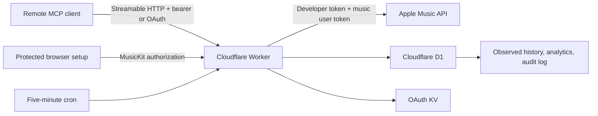

# Apple Music MCP on Cloudflare

Connect Apple Music to any MCP client that supports remote Streamable HTTP servers.

This self-hosted server runs on Cloudflare Workers, keeps its state in your own D1 database, and uses Apple’s documented MusicKit and Apple Music API surfaces. One deployment connects to one Apple Music account.

## Why use it

- Search the Apple Music catalog and inspect a connected library.
- Read playlists, recommendations, heavy rotation, and official Replay summaries.
- Create playlists and safely append tracks with preview, matching, and duplicate checks.
- Collect recently played tracks every five minutes into an indefinitely retained observed-history ledger.
- Query bounded history pages, summaries, and rankings for preset or exact timeframes.
- Connect with either a static bearer key or MCP OAuth discovery.
- Keep Apple credentials in Worker secrets and encrypt the Apple music user token before D1 storage.

## How it works



The Worker signs short-lived ES256 Apple developer tokens. Browser setup obtains a music user token, encrypts it with AES-GCM, and stores only the ciphertext in D1. A scheduled handler compares Apple’s current recently played window with the preceding snapshot and stores newly observed events.

## Choose a deployment

| | Cloudflare deployment | Local development |
| --- | --- | --- |
| MCP URL | Public HTTPS Worker URL | `http://127.0.0.1:8787/mcp` |
| Availability | Always on | Only while Wrangler and the computer are running |
| History collection | Automatic five-minute Cron Trigger | Requires manual or host-scheduled calls to the local scheduled-test route |
| Storage | Managed D1 and KV in your Cloudflare account | Simulated D1 and KV under `.wrangler/state` |
| Best use | Normal remote access and durable collection | Development, testing, or a deliberately managed private host |

Cloudflare is the recommended deployment. Neither mode can backfill listening activity from before collection begins.

## Prerequisites

You need:

- Node.js 22.18 or newer and npm.
- A Cloudflare account with Workers, D1, and KV access.
- An Apple Developer Program account with Account Holder or Admin access for Media IDs and keys.
- An active Apple Music subscription for the account you will connect.
- An MCP client that supports remote Streamable HTTP servers. OAuth support is optional because a static bearer key is also available.

## Part 1: Create Apple credentials

In [Certificates, Identifiers & Profiles](https://developer.apple.com/account/resources/identifiers/list):

1. Open **Identifiers** and select **+**.
2. Choose **Media IDs** and continue.
3. Enter a user-facing description and a reverse-domain identifier.
4. Enable the Apple Music or MusicKit service and register the Media ID.
5. Open **Keys**, select **+**, and create a key with **Media Services** enabled.
6. Associate the key with the Media ID.
7. Download the `.p8` private key immediately. Apple does not allow another download later.
8. Record the key ID and your Apple Developer team ID.

Keep the `.p8` file private. The server needs its complete contents, including the `BEGIN PRIVATE KEY` and `END PRIVATE KEY` lines.

## Part 2: Deploy to Cloudflare

### 1. Get the project

```bash
git clone https://github.com/CONTRIBUTOR/apple-music-mcp.git
cd apple-music-mcp
npm ci
```

### 2. Sign in to Cloudflare

```bash
npx wrangler login
npx wrangler whoami
```

### 3. Create the deployment configuration

```bash
cp wrangler.example.toml wrangler.toml
```

`wrangler.toml` is ignored by Git. Keep it local.

Create the OAuth KV namespace:

```bash
npx wrangler kv namespace create OAUTH_KV
```

Copy the returned namespace ID into this block in `wrangler.toml`:

```toml
[[kv_namespaces]]
binding = "OAUTH_KV"
id = "<YOUR_KV_NAMESPACE_ID>"
```

Create the D1 database:

```bash
npx wrangler d1 create apple-music-mcp
```

Copy the returned database ID into `wrangler.toml`:

```toml
[[d1_databases]]
binding = "DB"
database_name = "apple-music-mcp"
database_id = "<YOUR_D1_DATABASE_ID>"
migrations_dir = "migrations"
```

### 4. Create the secrets

Generate four different random values. Use a password manager or run this command four times:

```bash
openssl rand -base64 32
```

Store each value under a different name:

| Secret | Purpose |
| --- | --- |
| `MCP_API_KEY` | Static bearer key for `/mcp` and `/sse`. |
| `SETUP_TOKEN` | Unlocks the short-lived browser setup session. |
| `OAUTH_CONSENT_TOKEN` | Approves MCP OAuth clients; keep it distinct from `SETUP_TOKEN`. |
| `TOKEN_ENCRYPTION_KEY` | Encrypts the Apple music user token stored in D1. Keep it for the lifetime of that token. |
| `APPLE_TEAM_ID` | Apple Developer team identifier used as JWT issuer. |
| `APPLE_KEY_ID` | Media Services private-key identifier. |
| `APPLE_PRIVATE_KEY` | Complete contents of the downloaded `.p8` file. |

Set them interactively so they do not appear in shell history:

```bash
npx wrangler secret put MCP_API_KEY
npx wrangler secret put SETUP_TOKEN
npx wrangler secret put OAUTH_CONSENT_TOKEN
npx wrangler secret put TOKEN_ENCRYPTION_KEY
npx wrangler secret put APPLE_TEAM_ID
npx wrangler secret put APPLE_KEY_ID
npx wrangler secret put APPLE_PRIVATE_KEY
```

Do not put secret values in `wrangler.toml`, source files, issue reports, or copied terminal output.

### 5. Apply the database schema

```bash
npx wrangler d1 migrations list apple-music-mcp --remote
npx wrangler d1 migrations apply apple-music-mcp --remote
```

The migrations create:

- `auth_tokens` for the encrypted Apple music user token.
- `config` for short-lived authorization state and the cached storefront.
- `listen_events` for normalized observed listening events.
- `track_resource_versions` for deduplicated raw Apple payload versions.
- `analytics_state` and `analytics_ingest_runs` for collection state and health.
- `audit_log` for bounded MCP activity records.

### 6. Validate and deploy

```bash
npm test
npm run typecheck
npx wrangler deploy --dry-run
npm run deploy
```

The deploy output prints a URL such as:

```text
https://apple-music-mcp.<YOUR_SUBDOMAIN>.workers.dev
```

Your primary MCP endpoint is:

```text
https://apple-music-mcp.<YOUR_SUBDOMAIN>.workers.dev/mcp
```

### 7. Connect the Apple Music account

Open this clean URL in a browser:

```text
https://apple-music-mcp.<YOUR_SUBDOMAIN>.workers.dev/setup
```

Then:

1. Enter `SETUP_TOKEN` in the protected form.
2. Select **Authorize Apple Music**.
3. Complete Apple’s authorization prompt.
4. Wait for **Apple Music connected**.

The setup token is submitted in a POST body and exchanged for a ten-minute HttpOnly session. Do not add the token to the URL. The Apple authorization state is hashed at rest, bound to that browser session, expires after ten minutes, and is consumed once.

Apple does not provide a refresh token for the music user token. If access later expires, return to `/setup` and authorize again.

### 8. Connect an MCP client

Use one of the following authentication modes.

#### Option A: Static bearer key

Enter these fields in the client’s remote MCP server form:

- Name: `Apple Music`
- URL: `https://apple-music-mcp.<YOUR_SUBDOMAIN>.workers.dev/mcp`
- Transport: `Streamable HTTP`
- Header name: `Authorization`
- Header value: `Bearer <MCP_API_KEY>`

If the client accepts JSON configuration, adapt this generic shape to its field names:

```json
{
  "name": "Apple Music",
  "url": "https://apple-music-mcp.<YOUR_SUBDOMAIN>.workers.dev/mcp",
  "transport": "streamable-http",
  "headers": {
    "Authorization": "Bearer <MCP_API_KEY>"
  }
}
```

#### Option B: MCP OAuth

For a client that implements MCP OAuth discovery:

1. Add only the `/mcp` URL.
2. Start the client’s authorization flow.
3. In the browser consent page, confirm the displayed client name.
4. Enter `OAUTH_CONSENT_TOKEN`.
5. Return to the client after authorization completes.

OAuth uses S256 PKCE, one-hour access tokens, 30-day refresh tokens, and the single `apple_music` scope. One deployment is intentionally one owner and one Apple Music account; every authorized client receives the same tool set.

### 9. Verify the connection

Call `apple_music_status`. A healthy result resembles:

```json
{
  "appleCredentialsConfigured": true,
  "connected": true,
  "storefront": "us"
}
```

Then call `apple_music_analytics_status` to verify that the history collector can read its D1 state.

## Local development

### 1. Install and configure

```bash
npm ci
cp .dev.vars.example .dev.vars
```

Edit `.dev.vars` with four different random values plus the Apple team ID, key ID, and complete private key. `.dev.vars` is ignored by Git.

Apply the local migrations:

```bash
npm run db:migrate:local
```

### 2. Start the Worker

```bash
npm run dev:local
```

Keep this process running. Open:

```text
http://127.0.0.1:8787/setup
```

Enter the local `SETUP_TOKEN`, authorize Apple Music, and connect a client to:

```text
http://127.0.0.1:8787/mcp
```

Use `Authorization: Bearer <MCP_API_KEY>` unless the client supports the local OAuth flow.

Do not expose port 8787 publicly. The server rejects browser requests whose `Origin` does not match the server origin, but local network binding, TLS, and firewall policy remain the operator’s responsibility.

### 3. Trigger local collection

Wrangler does not automatically fire Cron Triggers in a local session. While `npm run dev:local` is running, trigger one collection pass with:

```bash
curl -fsS 'http://127.0.0.1:8787/__scheduled?cron=%2A%2F5+%2A+%2A+%2A+%2A'
```

For continuous local history, schedule that request every five minutes and keep Wrangler running. Local D1 and KV state persist under `.wrangler/state`; back up that directory separately if the observed history matters.

## MCP tools

The server exposes 14 tools.

| Tool | What it does | Important inputs |
| --- | --- | --- |
| `apple_music_status` | Checks Apple credentials, connection, token age, and storefront. | None |
| `apple_music_recently_played` | Pages through observed D1 history. | `preset` or `start`/`end`, `limit`, `cursor`, `refreshFirst` |
| `apple_music_heavy_rotation` | Reads Apple Music heavy rotation. | `limit` up to 10 |
| `apple_music_recommendations` | Reads personalized recommendation groups. | `limit` up to 10 |
| `apple_music_replay_summary` | Reads official latest-year Replay totals and top content. | None |
| `apple_music_list_playlists` | Lists library playlists and editability. | `limit` up to 500 |
| `apple_music_get_playlist_tracks` | Reads tracks from a library playlist. | `playlistId`, `limit` |
| `apple_music_search_catalog` | Searches songs, albums, artists, playlists, or music videos. | `term`, `types`, `limit` |
| `apple_music_create_playlist` | Creates an empty library playlist. | `name`, `description` |
| `apple_music_add_tracks_to_playlist` | Resolves, previews, deduplicates, and appends up to 100 tracks. | `playlistId`, `tracks`, `dryRun`, `allowPartial` |
| `apple_music_analytics_refresh` | Refreshes the observed listening ledger. | `limit` up to 30 |
| `apple_music_analytics_status` | Reports ledger coverage and recent ingest runs. | None |
| `apple_music_listening_summary` | Returns observed totals and top categories for a timeframe. | `preset` or `start`/`end` |
| `apple_music_top_stats` | Ranks tracks, artists, albums, or genres. | `preset` or `start`/`end`, `kind`, `limit` |

### Timeframe examples

Last 30 days:

```json
{
  "preset": "30d",
  "limit": 20
}
```

Exact range with explicit offsets:

```json
{
  "start": "2026-08-01T00:00:00-06:00",
  "end": "2026-08-15T00:00:00-06:00",
  "limit": 50
}
```

All observed history:

```json
{
  "preset": "all_time",
  "limit": 50
}
```

Presets are `today`, `24h`, `7d`, `30d`, `90d`, `ytd`, `last_year`, and `all_time`. Use either a preset or a custom inclusive `start` and optional exclusive `end`. Custom timestamps must include `Z` or a UTC offset. Calendar presets default to `America/Denver`; provide an IANA `timeZone` to override it.

History pages default to 50 and are capped at 200. When `coverage.hasMore` is true, pass `nextCursor` on the next call. The cursor preserves the original timeframe so a rolling preset cannot shift between pages.

### Safe playlist writes

The playlist write surface is intentionally narrow:

- It creates playlists and appends tracks; it does not delete, remove, reorder, or edit playlist metadata.
- Unknown songs are matched against up to 10 catalog candidates.
- Title, artist, and version checks reject unintended remixes, live recordings, covers, and similar variants.
- Existing playlist tracks and duplicate request IDs are skipped.
- One unresolved or ambiguous song blocks the batch unless `allowPartial: true` is explicitly chosen.
- `dryRun: true` previews matching and deduplication without changing Apple Music.
- A completed append is read back with bounded retries.
- `pending_apple_propagation` means Apple accepted the write but its eventually consistent library read has not caught up yet.

Use `dryRun: true` before large or important batches.

## Listening-history limits

Apple’s recently played endpoint is not a historical export. It returns at most 30 tracks and does not include play timestamps.

As a result:

- History cannot be backfilled.
- `observedAt` is estimated within the polling interval.
- More than 30 changes between polls can create a permanent gap.
- A timeframe is not complete unless the collector covered all of it without a gap.
- The ledger retains each observed event indefinitely, while identical raw Apple payloads are content-addressed and deduplicated.
- `apple_music_replay_summary` is the correct source for authoritative latest-year Replay totals.

## Routes and authentication

| Route | Access | Purpose |
| --- | --- | --- |
| `/` | Public | Minimal service descriptor. |
| `/mcp` | OAuth access token or `MCP_API_KEY` | Primary Streamable HTTP endpoint. |
| `/sse` | `MCP_API_KEY` | Legacy endpoint name using the same MCP handler. |
| `/authorize` | CSRF check plus `OAUTH_CONSENT_TOKEN` | Owner approval for MCP OAuth clients. |
| `/oauth/token` | OAuth protocol | Token exchange and refresh. |
| `/oauth/register` | OAuth protocol | Dynamic client registration. |
| `/setup` | Short-lived session established with `SETUP_TOKEN` | Apple Music authorization page. |
| `/auth/apple/token` | Setup session plus one-time state | Receives and encrypts the Apple music user token. |

Never put access tokens, setup tokens, or OAuth tokens in a URL.

## Security model

- All MCP calls require OAuth or the static bearer key.
- Cross-origin browser MCP requests are rejected unless the `Origin` matches the server origin.
- Setup and OAuth approval use different secrets.
- Public form and JSON bodies are type-checked and size-limited before parsing.
- Setup sessions are HMAC-authenticated, HttpOnly, SameSite, and ten minutes long.
- Apple setup state is hashed, session-bound, expiring, and atomically consumed.
- Apple’s music user token is encrypted with AES-GCM before D1 storage.
- The Apple API origin is fixed and caller-controlled path components are encoded.
- Tool inputs, result sizes, Apple request timeouts, retries, and concurrency are bounded.
- Audit identity comes from authenticated server context, not a caller-supplied header.
- Audit rows are retained for `AUDIT_RETENTION_DAYS`, defaulting to 90, and purged by the scheduled handler.
- Playlist writes are append-oriented and exclude destructive operations.

This remains a single-owner system. Anyone who receives either an OAuth grant or `MCP_API_KEY` can use every exposed tool against the one connected Apple Music account.

## Updating an existing deployment

1. Run `npm ci`.
2. Set the generic `MCP_API_KEY` secret to the bearer value you want clients to use.
3. Create a new, different `OAUTH_CONSENT_TOKEN` secret.
4. Apply all remote D1 migrations, including the audit-table migration.
5. Deploy the Worker.
6. Update client headers to use `MCP_API_KEY`.
7. Open `/setup` without query parameters and reauthorize only if `apple_music_status` reports disconnected.

Migration `0005_generic_audit_log.sql` preserves existing audit rows while changing the actor field to the client-neutral `client_id` name and adding the retention index.

## Operations and troubleshooting

### Useful commands

```bash
npm test
npm run typecheck
npm run dev:local
npm run db:migrate:local
npx wrangler d1 migrations list apple-music-mcp --remote
npx wrangler deploy --dry-run
npx wrangler tail
```

### MCP returns `Unauthorized`

For static authentication, confirm the client sends exactly:

```text
Authorization: Bearer <MCP_API_KEY>
```

For OAuth, restart the client’s authorization flow if its access and refresh tokens have expired.

### Apple Music is disconnected

Open `/setup`, enter `SETUP_TOKEN`, and authorize again. If the page reports missing Apple credentials, check:

```bash
npx wrangler secret list
```

### History is shorter than expected

Call `apple_music_analytics_status`, confirm the five-minute cron is deployed, and inspect recent ingest runs. Downtime and more than 30 upstream changes between polls cannot be recovered later.

### Raw HTTP testing returns `Not Acceptable`

Streamable HTTP requests must accept both supported response types:

```text
Accept: application/json, text/event-stream
```

Normal MCP clients set this automatically.

### Local state reset

Local D1, KV, authorization, and history live under `.wrangler/state`. Removing that directory resets local state. Back it up before resetting if the observed history matters.

## Project structure

```text
src/
  index.ts            Worker routes, MCP authentication, OAuth, and scheduled work
  setup.ts            Protected browser MusicKit authorization flow
  setup-session.ts    Short-lived signed setup-session tokens
  http-security.ts    Body limits, cookie parsing, comparisons, and security headers
  mcp.ts              Tool definitions, schemas, safety metadata, and write verification
  apple.ts            Apple Music API client and developer-token signing
  apple-transport.ts  Timeouts, retry policy, and bounded concurrency
  analytics.ts        D1 collection, history pagination, and SQL statistics
  recent-history.ts   Snapshot diffing and history cursors
  timeframe.ts        Preset and custom timeframes
  song-matching.ts    Conservative catalog matching
  storage.ts          Encrypted token, config, audit, and retention persistence
  crypto.ts           ES256 signing and AES-GCM encryption
  format.ts           Compact MCP response formatting
  types.ts            Worker and Apple API types
migrations/           Ordered D1 schema migrations
test/                 Functional, safety, storage, and metadata tests
wrangler.example.toml Cloudflare deployment template
wrangler.local.toml   Local workerd, D1, and KV configuration
```

## Official references

- [Apple: create a media identifier and private key](https://developer.apple.com/help/account/capabilities/create-a-media-identifier-and-private-key/)
- [Apple: create and download a private key](https://developer.apple.com/help/account/keys/create-a-private-key/)
- [Apple: generate developer tokens](https://developer.apple.com/documentation/applemusicapi/generating-developer-tokens)
- [Cloudflare: D1 getting started](https://developers.cloudflare.com/d1/get-started/)
- [Cloudflare: D1 migrations](https://developers.cloudflare.com/d1/reference/migrations/)
- [Cloudflare: KV Wrangler commands](https://developers.cloudflare.com/workers/wrangler/commands/kv/)
- [Cloudflare: Worker secrets](https://developers.cloudflare.com/workers/configuration/secrets/)
- [Cloudflare: Cron Triggers](https://developers.cloudflare.com/workers/configuration/cron-triggers/)
- [MCP: Streamable HTTP transport](https://modelcontextprotocol.io/specification/2025-06-18/basic/transports)
- [MCP: HTTP authorization](https://modelcontextprotocol.io/specification/2025-06-18/basic/authorization)
